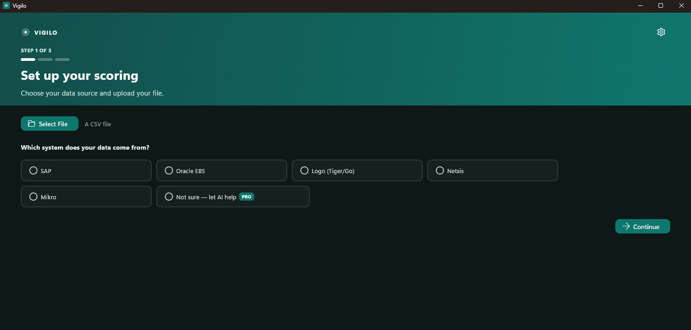
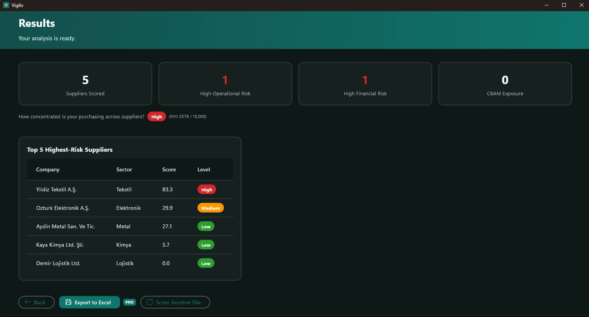
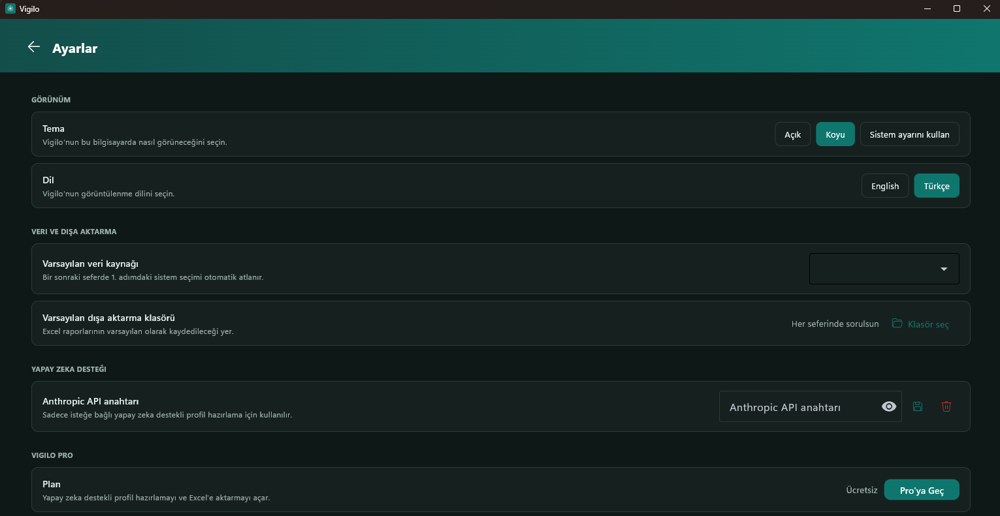

# Vigilo — Supplier Risk, as a Windows App

**[Get it on the Microsoft Store →](https://apps.microsoft.com/detail/9P71F79X5V8M)**

Vigilo packages the scoring engine from my [Supplier Risk & Performance Scoring
project](https://github.com/AykutKocer/supplier-risk-scoring) into a real, installable
Windows desktop application — built for procurement and supply chain teams who need a
supplier risk score without a data analyst or an enterprise risk-management budget.

Upload a supplier export from SAP, Oracle EBS, Logo (Tiger/Go), Netsis, or Mikro, and
Vigilo turns delivery delays, price volatility, supplier dependency, and financial risk
into a clear risk score in a few minutes. No data science background required, and the
file never leaves the machine it's opened on.

This repository is a **showcase**, not a source-code mirror — the packaged application
is distributed exclusively through the Microsoft Store. What's documented here is the
product itself: what it does, how it's built, and the design decisions behind it.

---

## What it does

- **Five built-in ERP profiles** (SAP, Oracle EBS, Logo, Netsis, Mikro), each mapped to
  real, publicly documented export field names — plus an AI-assisted option that drafts
  a column mapping for any format that isn't already built in.
- **Two independent risk axes**: operational (delivery delay, price volatility, spend
  concentration) and financial (overdue debt, leverage, payment history), so a supplier
  can look fine on one axis and be flagged on the other.
- **EU CBAM compliance exposure flag** for suppliers in carbon-intensive sectors that
  export to the EU.
- **One-click Excel export** — a formatted, presentation-ready workbook, not a bare data
  dump.
- **100% local processing.** Vigilo has no backend and no telemetry; supplier data never
  leaves the PC it's opened on.
- **Turkish and English UI**, switchable from Settings.

**Free vs. Pro:** the core scoring pipeline — all five ERP profiles, both risk axes, CBAM
flagging — is free. Pro unlocks AI-assisted format detection for unrecognized ERP
exports and the Excel export, through a real Microsoft Store in-app purchase.

## Screenshots

  
  
  

## How it's built

Vigilo reuses the same cleaning and scoring engine as
[`supplier-risk-scoring` v2](https://github.com/AykutKocer/supplier-risk-scoring) —
profile-driven cleaning, independent operational/financial scoring, AHP-weighted
consistency checks, HHI-based concentration risk — wrapped in a native desktop shell:

- **UI:** [Flet](https://flet.dev) (Python, Flutter-rendered), packaged for Windows via
  the Desktop Bridge (MSIX), so it installs and updates like any other Store app while
  the app itself is a full-trust Win32 process.
- **In-app purchase:** the real `Windows.Services.Store` WinRT API — the same
  entitlement check real Store apps use, not a license-key or server call of my own.
- **Distribution:** Microsoft Store only. No installer, no separate download link —
  that's a deliberate choice, both so updates are seamless for users and so the Pro
  unlock stays a real Store transaction rather than something a copied `.exe` could
  route around.
- **Icon and window chrome:** baked in at build time (via `flutter_launcher_icons`
  through `flet build`), Segoe Fluent Icons and Segoe UI Variable Text for the UI so it
  reads as native Windows 11, not a ported web app.

## Where the engine comes from

The algorithmic core — the weighted scoring model, the AHP consistency check, the HHI
concentration math, the CBAM exposure logic — is fully open-source in
[`supplier-risk-scoring`](https://github.com/AykutKocer/supplier-risk-scoring)
(`v1`/`v2` tags, 121 tests). Vigilo is that engine wrapped in a real product: a guided
setup flow, native packaging, and a real purchase flow, aimed at someone who wants to
run a supplier risk assessment without opening a notebook.

## Author

**Aykut Koçer** — [LinkedIn](https://linkedin.com/in/aykut-kocer) ·
[GitHub](https://github.com/AykutKocer)

Built with AI-assisted implementation (Claude Code) where I had gaps in my coding
knowledge — the design decisions, the scoring logic, and the product choices are mine.
